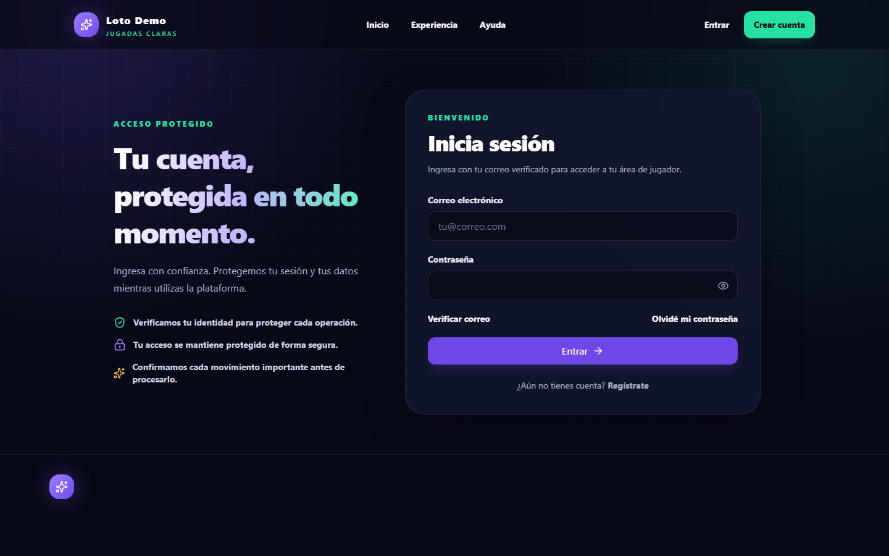
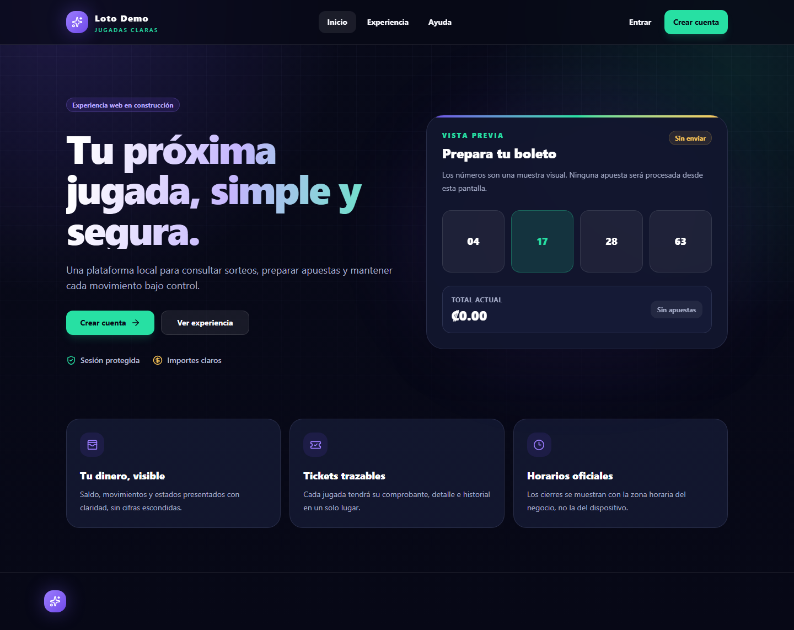

# Transactional Lottery Platform

Plataforma full-stack para gestionar cuentas, billeteras, depósitos, retiros, sorteos, apuestas, límites de exposición y pagos automáticos con énfasis en consistencia financiera.

> Edición demostrativa para portafolio. Funciona con datos ficticios, no procesa dinero real y no está afiliada con ninguna lotería o institución oficial.

## Vista del producto

| Acceso | Panel de usuario |
| --- | --- |
|  |  |

Las capturas se generan a partir de pruebas visuales con datos de demostración y forman parte del control de regresiones de la interfaz.

## Problema que resuelve

El sistema coordina operaciones que no pueden quedar parcialmente aplicadas:

```text
identidad y KYC
   -> fondos disponibles o retenidos
   -> sorteo abierto y límites
   -> apuesta idempotente
   -> resultado único
   -> pago o conciliación
```

La prioridad de diseño es proteger saldos, tickets y resultados ante solicitudes duplicadas, concurrencia, timeouts y fallos intermedios.

## Capacidades principales

- Registro, autenticación y verificación de correo.
- KYC y autorización por roles.
- Billetera con saldo disponible y saldo retenido.
- Depósitos y retiros con revisión administrativa.
- Sorteos automáticos y cierre programado.
- Apuestas múltiples con límites por número y exposición.
- Idempotencia mediante `requestId`.
- Resultados y pagos procesables una sola vez.
- Reglas globales y multiplicadores con snapshots históricos.
- Panel de usuario y panel administrativo separados.
- PWA responsive con manejo conservador de operaciones monetarias.

## Arquitectura

```text
React PWA
   -> shared/api
REST API Express 5
   -> route + middleware + Joi
   -> controller
   -> service
   -> adaptador SQL
   -> MySQL / InnoDB

Scheduler
   -> jobs idempotentes
   -> locks y transacciones
   -> MySQL
```

El backend usa una arquitectura modular por feature e inyección manual de dependencias. Las rutas declaran HTTP; los controllers coordinan; los services aplican reglas; y los adaptadores SQL concentran persistencia, transacciones y locks.

## Decisiones técnicas destacadas

### Operaciones atómicas

Los cambios de saldo, apuestas, depósitos, retiros, límites, resultados y pagos usan una sola conexión durante `beginTransaction -> commit`. Los errores ejecutan rollback y liberan la conexión en `finally`.

### Control de concurrencia

Las filas críticas se bloquean con `SELECT ... FOR UPDATE` dentro de la transacción. El sistema combina locks, restricciones únicas, estados condicionales y un orden consistente de bloqueo.

### Idempotencia

Cada intención financiera genera un `requestId` una sola vez. Los reintentos después de un timeout reutilizan el mismo identificador y payload, evitando duplicar movimientos o tickets.

### Resultado de commit incierto

Si la conexión falla durante `commit`, el sistema no asume automáticamente éxito ni rollback. La operación se concilia utilizando el mismo identificador idempotente.

### Precisión monetaria

Los importes se conservan como `DECIMAL` y strings. Los cálculos sensibles no dependen de punto flotante y el frontend usa `Intl.NumberFormat` únicamente para presentación.

### Seguridad del cliente

El frontend centraliza llamadas HTTP y no realiza actualizaciones optimistas de dinero. Las mutaciones sensibles no se reintentan automáticamente ni se encolan para ejecución offline.

## Retos, decisiones y compensaciones

| Reto | Decisión aplicada | Compensación asumida |
| --- | --- | --- |
| Proteger saldos durante apuestas, depósitos, retiros y pagos simultáneos | Ejecutar cada cambio financiero en una transacción y bloquear las filas críticas con `SELECT ... FOR UPDATE` | Los recursos muy disputados pueden reducir throughput, pero nunca se prioriza velocidad sobre consistencia monetaria |
| Evitar duplicados después de timeouts o reintentos manuales | Asignar un `requestId` por intención y respaldarlo con restricciones únicas y recuperación del resultado existente | Cliente y servidor deben conservar el identificador hasta resolver el estado de la operación |
| Tratar una desconexión durante `commit` | Marcar el resultado como incierto y conciliarlo mediante la clave idempotente en vez de asumir rollback | La recuperación es más compleja, pero evita repetir una operación que posiblemente sí fue confirmada por MySQL |
| Prevenir carreras entre cancelaciones, resultados y pagos | Definir unidades de idempotencia, estados condicionales y un orden consistente de bloqueo | Requiere diseñar conjuntamente todos los procesos que escriben el mismo estado |
| Mantener exactitud monetaria en JavaScript | Conservar importes como `DECIMAL` y strings, y limitar `Intl.NumberFormat` a presentación | Se necesita conversión explícita y utilidades propias, evitando los errores silenciosos de punto flotante |
| Automatizar el ciclo de vida de los sorteos | Reservar creación, apertura, cierre y pago para jobs idempotentes | Reduce acciones manuales de administración y exige observabilidad y recuperación operativa de los workers |
| Convertir la aplicación en PWA | Cachear solamente shell y assets; no cachear datos privados ni encolar mutaciones financieras offline | Se pierde operación monetaria sin conexión, pero no se presentan como confirmadas acciones que el servidor desconoce |

### Aprendizajes principales

- Un timeout no significa necesariamente que una transacción falló; el resultado puede ser desconocido para el cliente.
- Los locks funcionan mejor cuando se define un orden global y se mantienen pequeñas las secciones críticas.
- Los valores históricos que determinan dinero deben guardarse como snapshots y no depender de reglas actuales.
- La autorización del backend sigue siendo obligatoria aunque el frontend oculte rutas y controles.
- En sistemas financieros, una experiencia de usuario más conservadora suele ser preferible a actualizaciones optimistas difíciles de revertir.

## Stack

Backend:

- JavaScript ESM, Node.js y Express 5.
- MySQL mediante `mysql2/promise`.
- Joi, JWT, bcrypt, Helmet, HPP y rate limiting.
- Winston para logging sanitizado.
- Jest y Supertest.

Frontend:

- React, Vite y React Router.
- TanStack Query, React Hook Form y Zod.
- Tailwind CSS.
- Vitest, Testing Library y Playwright.
- PWA web con Workbox.

## Estructura

```text
src/modules/            dominios del backend
src/container/          composición e inyección manual
src/schemas/            validaciones Joi
src/shared/database/    SQL, transacciones y bloqueos
src/shared/middleware/  autenticación, autorización y validación
src/shared/error/       contrato global de errores
frontend/src/features/  dominios de la interfaz
frontend/src/shared/    API client, sesión y utilidades comunes
```

Dominios principales del backend:

- `auth`
- `wallet`
- `kyc`
- `deposits`
- `withdrawls`
- `draw`
- `bets`
- `limits`
- `payout-rules`
- `settings`
- `admin`
- `jobs`

`withdrawls` conserva el nombre histórico del contrato para evitar una migración incompatible.

## Ejecución local

Requisitos:

- Node.js compatible con las dependencias bloqueadas.
- MySQL 8.

Backend:

```bash
npm ci
cp .env.example .env
npm run dev
```

Frontend:

```bash
cd frontend
npm ci
cp .env.example .env.local
npm run dev
```

La base local debe prepararse de manera aislada. Los scripts de migración y demo incluyen guardas para impedir escrituras accidentales sobre un ambiente no autorizado.

## Calidad

```bash
npm run check
npm --prefix frontend run lint
npm --prefix frontend run test
npm --prefix frontend run build
```

La edición pública excluye deliberadamente pruebas y herramientas que operaban sobre la base configurada del proyecto privado.

## Alcance de esta edición

No se incluyen:

- credenciales, datos o documentos KYC reales;
- configuración de staging o producción;
- scripts de auditoría o reparación de una base existente;
- logs, cobertura, builds o reportes generados;
- documentación interna de planificación;
- archivos comerciales o documentos Word;
- historial Git del proyecto operativo.

## Estado

Copia pública saneada y verificada localmente. Se mantiene separada del repositorio operativo y está preparada para una última revisión humana antes de publicarse.

## Licencia

Este proyecto se distribuye bajo la licencia MIT. Consulta [LICENSE](LICENSE) para conocer sus términos.
